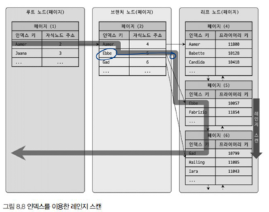
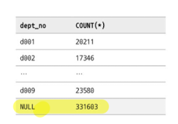
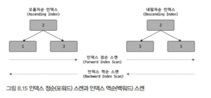

### 11.4.4 distinct

311p.

DISTINCT를 사용할 때 자주 실수하는 것이 있다. DISTINCT는 SELECT하는 레코드(튜플)를 유니크하게 SELECT하는 것이지, 특정 칼럼만 유니크하게 조회하는 것이 아니다. 즉, 다음 쿼리에서 SELECT하는 결과 는 first_name만 유니크한 것을 가져오는 것이 아니라 (first_name, last_nane) 조합 전체가 유니크한 레코드를 가져오는 것이다.


**집합 함수 내에서 DISTINCT 키워드가 사용되는 경우**

``` sql
EXPLAIN SELECT COUNT(DISTINCT s.salary)
FROM employees e, salaries s
```

인자로 전달된 칼림값이 유니크한 것을 가져옴.


### 11.4.5 LIMIT N

Q. 각 쿼리의 실행계획을 생각해봅시다.

``` sql
1.
SELECT * FROM employees LIMIT 0,10;

2.
SELECT * FROM employees GROUP BY first_name LIMIT 0, 10;

3.
SELECT DISTINCT first_name FROM employees LIMIT 0, 10;

4.
SELECT * FROM employees
WHERE emp_no BETWEEN 18091 AND 11000
ORDER BY first_name
LIMIT 0, 10;
```

> 1. 풀테이블스캔하면서 10개 찾으면 종료
> 2. groupby 끝나고나서 limit 처리. -> limit이 작업을 크게 줄여주지는 못함
> 3. 풀 테이블 스캔 방식을 이용해 employee 테이블 레코드를 읽어 들임과 동시에 DISTINCT를 위한 중복 제거 작업(임시 테이블을 사용)을 진행한다. 이 작업을 반복적으로 처리하다가 유니크한 레코드가 LIMIT 건수 만큼 채워지인 그 순간 쿼리를 엄춘다.
> 4. 정렬을 수행하면서 필요한 10건이 완성되는 순간. 나머지 작업을 멈추고 결과를 사용자에게 반환 한다.

Q. Limit 에 인자 두개를 넣으면 어떤 동작을 할까요?
> (오프셋, 가져올 개수)


80p 예제

LINIT 조건의 페이징이 처음 몇 개 페이지 조회로 끝나지 않을 가능성이 높다면 다음과 같이 WHERE 조건
절로 읽어야 할 위치를 찾고 그 위치에서 10개만 읽는 형태의 쿼리를 사용하는 것이 좋다.

-> 요즘 오프셋 페이징 방식보다 커서 페이징 방식 많이 쓰는 이유

-> 면접에 나와서 실행 계획 그리라고 함... ㅋㅋㅋ


Q. MyISAM 과 비교했을 때, InnoDB에서 count(*) 를 주의해야 하는 이유
> MyISAM 은 테이블에 대한 메타데이터를 가지고 있어서 무관
>
> innoDB는 직접 인덱스나 테이블을 전부 읽어야 함.
>
> 근데 이거 풀테이블스캔 아닌가요? 인덱스를 어떻게 활용하는거지..


### 11.4.7 JOIN

#### 11.4.7.1 Join의 순서와 인덱스

인덱스 레인지 스캔은 검색해야 할 인텍스의 범위가 결정됐을 때 사용하는 방식

시작해야 할 위치를 찾으면 그때부 터는 리프 노드의 레코드만 순서대로 읽으면 된다

끝까지 읽으면 리프 노드 간의 링크를 이용해 다음 리프 노드를 찾아 서 다시 스캔




특정 인덱스 자체를 찾는 것은 부하가 좀 있는 편이라고 한다.

Q. 조인 작업에서 드라이빙 테이블과 드라이븐 테이블의 `인덱스 탐색 작업 회수`는 어떻게 될까요?

> 조인 작업에서 드라이빙 테이블을 읽을 때는 인덱스 탐색 작업을 단 한 번만 수행하고, 그 이후부터는 스캔만 실행하면 된다. 하지만 드리븐 테이블에서는 인덱스 탐색 작업과 스캔 작업을 드라이빙 테이블 에서 읽은 레코드 건수만큼 반복

#### 11.4.7.2 join 칼럼의 데이터 타입
이전 챕터에서 봤듯이, 마찬가지로 일치시켜야함!

#### 11.4.7.3 OUTER JOIN의 성능과 주의사항
Q. A 테이블에 인덱스가 적절하게 걸려있고 B 테이블은 인덱스를 사용 못하는 경우, A테이블이 Outer table 이라면 드라이빙 테이블은 무엇일까요?
> B. 아우터 테이블은 드라이빙이 될 수 없음

#### 11.4.7.5 지연된 조인
Q. 지연된 조인이 무엇일까요?
> 조인이 실행되기 이전에 GROUP BY나 ORDER BY를 처리하는 방식을 의미한다. 지연된 조인은 주로 , LTMIT이 함께 사용된 쿼리에서 더 큰 효과를 얻을 수 있다.
>
>잘 튜닝된 지연된 쿼리는 원래의 쿼리보다 몇십 배.

#### 11.4.7.7 실행 계획으로 인한 정렬 흐트러짐
Q. 조인 이후 정렬이 흐트러지는 경우가 발생하는데 어떤 경우인가요?
> 네스티드-루프 조인은 알고리즘의 특성상 드라이빙 테이블에서 읽은 레코드의 순서가 다른 테이블이 모두 조인돼도 그대로 유지된다. 해시 조인이나 블록네스티드조인 사용되면 쿼리 결과의 레코드 정렬 순서가 달라진다. 

### 11.4.8 GROUPBY
#### 11.4.8.1 WITH ROLLUP

Q. with rollup 문법은 무엇일까요?
> 엑셀 피벗테이블처럼, 총계 레코드를 마지막 컬럼에 표시

```
SELECT dept_no, COUNT (*)
FROM dept_erp
GROUP BY dept_no WITH ROLLUP;
```



아침에 일어나서 남은 페이지부터 채우자.

### 11.4.9 ORDER BY

인덱스를 사용한 SELECT 쿼리이기 때문에 ORDER BY 절을 사용하지 않아도 된다는 것은 잘못된 생각이다. 항상 정렬이 필 요한 곳에서는 ORDER BY 절을 사용해야 한다.

뭔가 항상 간과했던..

Q. order by가 메모리만 이용해 정렬이 수 행됐는지 디스크의 파일을 이용했는지 알 수 있는 방법?

> 실제로 메모리만 이용해 정렬이 수 행됐는지 디스크의 파일을 이용했는지는 실행 계획을 통해서는 알 수 없지만 MySOL. 서버의 상태 값 을 확인해보면 알 수 있다.

```
SHON STATUS LIKE Sort_%";
```

#### 11.4.9.2 여러 방향으로 동시 정렬

1권 참고자료..

잠깐 내림차순 인덱스를 보고 가자면..

일반적으로 인덱스에 대해서 역으로 탐색하게 되면, 정순 인덱스보다 느리다.

이유는

- 페이지 잠금이 인덱스 정순 스캔(Forward index scan)에 적합한 구조
- 페이지 내에서 인덱스 레코드가 단방향으로만 연결된 구조

혹시라도 많은 쿼리가 인덱스의 앞쪽만 또는 뒤쪽만 집중적으로 읽어서 인텍스의 특정 페이지 잠금이 병목 이 될 것으로 예상된다면 쿼리에서 자주 사용되는 정렬 순서대로 인덱스를 생성하기

내림차순 인덱스라는 것이 있더라!



#### 11.4.9.3 함수나 표현식을 이용한 정렬

1권 참고: 함수기반인덱스

칼럼의 값을 변형해서 만들어진 값에 대해 인덱스를 구축해야 할 때도 있는데, 이러한 경우 함수 기반의 인덱스를 활용하면 된다


예시) first_name과 last_name만 가지고 있을 때, input으로 풀네임이 들어오는 경우
```
ALTER TABLE user
ADD full_name VARCHAR(30) AS (CONCAT(first_name, ' ' , last_nane)) VIRTUAL,
ADD INDEX ix fullname (full name);
```

```
SELECT * FROM user WHERE full name='Matt Lee'
```


#### 11.4.10.2 FROM 절에 사용된 서브쿼리

일반적으로 from 절에 서브쿼리 만들면, 임시테이블을 내부에서 생성함. -> 성능이슈

1권 참고: 파생테이블 머지?

```
SELECT * FROM (
    SELECT * FROM employees WHERE first names 'Matt'
    ) derived_table    
WHERE derived table.hire date='1986-04-03';
```

서브쿼리를 없앤다!
```
FROM employees. employees
WHERE ((employees.employees .hire_date = DATE '1986-04-03')
AND (employees.employees. first_ name = 'Matt'))
```

### 11.4.12 윈도우 함수(Window Function)

Q. 윈도우 함수는 무엇일까요?
> 인도우 함수는 조회하는 현재 레코드를 기준으로 연관된 레코드 집합의 연산을 수행한다.

오 좀 쓸모있나? 싶다가도 139p 마지막을 보면, 일반적인 온라인 트랜잭션에서는 적합하지 않음을 말함.


### 11.4.13 잠금을 사용하는 SELECT
#### 11.4.13.2 NOWAIT & SKIP LOCKED

Q. NOWAIT 은 무엇인가요?
> 레코드가 이미 잠겨진 상태라면 그냥 무시하고 즉 시 에러를 반환하면 응용 프로그램에서 다른 처리를 수행하거나 다시 트랜잭션을 시작하도록 구현해 야 할 때도 있다. 이럴 때 SELECT 쿼리의 마지막에 NOWAIT 옵션을 사용

Q. SKIP LOCKED 는 무엇인가요?
> SKIP LOCKED 옵션은 SELECT하려는 레코드가 다른 트랜잭션에 의해 이미 잠겨진 상태라면 에러를 반환하지 않고 잠긴 레코드는 무시하고 잠금이 걸리지 않은 레코드만 가져온다.


쿠폰 예제 진짜 재미있어 보임
